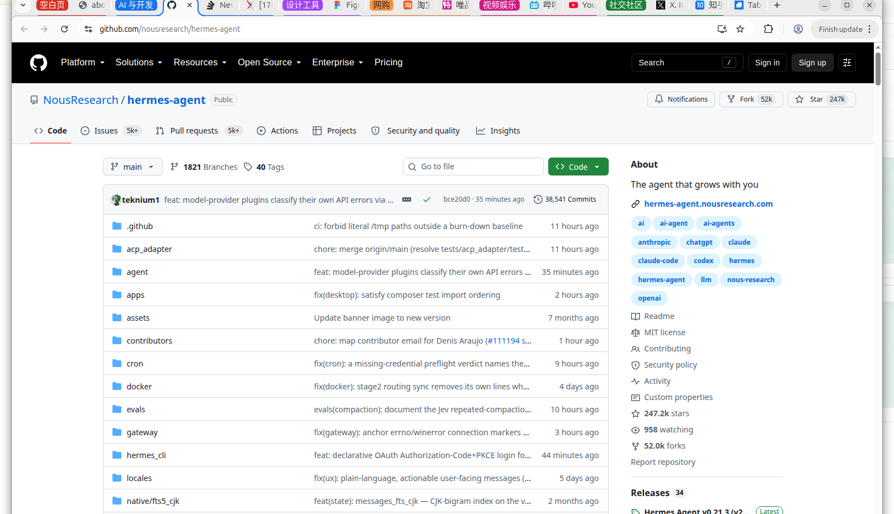
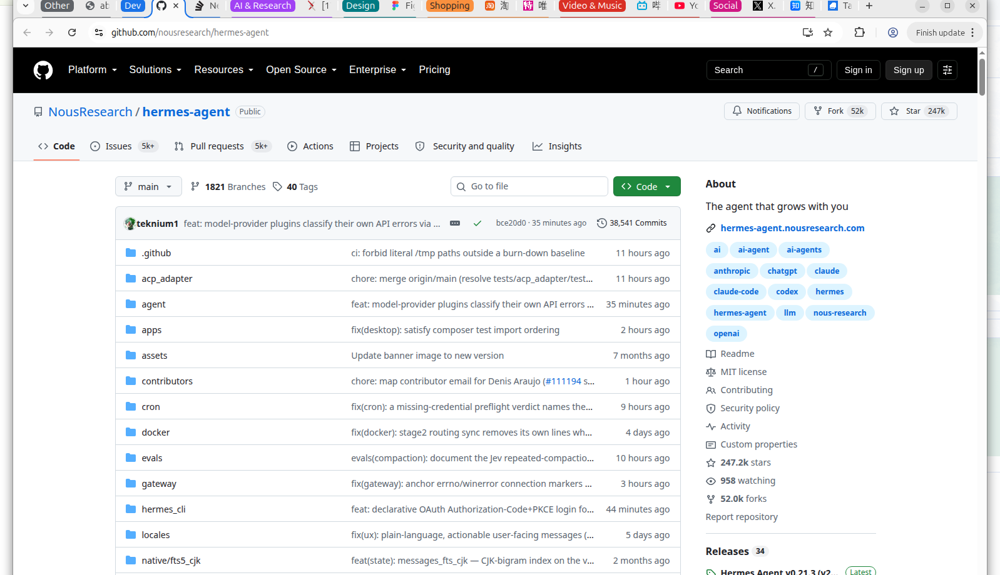
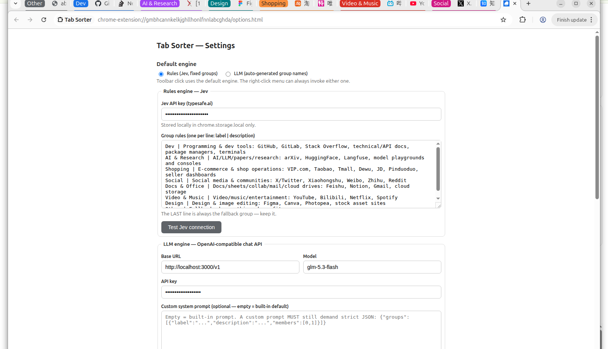
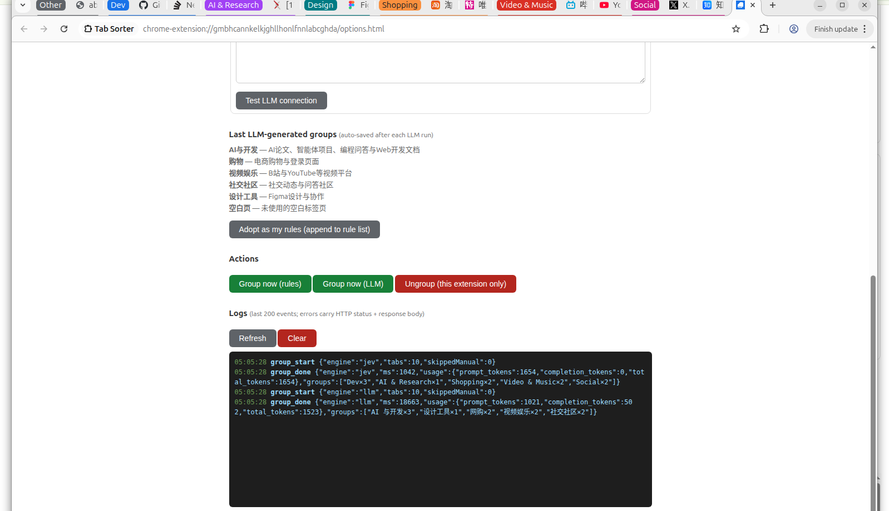

<div align="center">

# Tab Sorter

**不会真的有人手动整理 Chrome 标签页吧？**

One click. Every tab in the window sorts itself into named, colored groups.

[](https://developer.chrome.com/docs/extensions/develop) [](LICENSE) [](../../releases)

</div>

---



*The LLM engine looked at 10 tabs and invented its own groups: AI 与开发 / 设计工具 / 网购 / 视频娱乐 / 社交社区.*

## Why this exists

You have 30 tabs open. Again. Manually dragging them into groups is a System-2 job — slow, boring, and you won't do it. Tab Sorter makes it a **System-1** job:

| | **Rules engine (Jev)** | **LLM engine** |
|---|---|---|
| Group names | You define them, once | The model invents them, every run |
| Speed | **~1s** for the whole window | 10–30s (model-dependent) |
| Cost | Jev: pennies per month of daily use (output tokens are ~free) | Standard chat pricing |
| Certainty | 100% structured answers, zero parsing failures | Strict-JSON prompt + lenient parser + fallback bucket |
| Best for | Daily cleanup with your fixed buckets | Discovering what your browsing actually clusters into |

**Why Jev is the default**: [Jev](https://typesafe.ai) is TypeSafe's "System One" model — state in, *typed* decisions out. Tab classification is literally one `choice` question per tab, answered in parallel, so a whole window resolves in a single sub-second call with **zero** completion tokens (Jev prices output at $0 — you only pay input). An LLM doing the same job burns 500+ output tokens per run and takes 20× longer. Rules for the daily habit, LLM for the exploration — both engines are one right-click away at all times.

## The 10-second tour

1. **Toolbar click** → your default engine groups the current window.
2. **Right-click the icon** → pick either engine, or ungroup (mine / all).
3. **Manual groups are sacred** — groups you built by hand are never touched.



*Same tabs, rules engine: fixed groups, 456 ms end-to-end.*

## Install

### From source (any Chromium browser)
```bash
git clone https://github.com/AstonyCat/jev-tab-grouper
```
`chrome://extensions` → Developer mode → **Load unpacked** → select the folder.

### From release zip
Grab `tab-sorter-v1.0.0.zip` from [Releases](../../releases), unzip, load unpacked.

## Setup

Open the options page and configure either or both engines:

- **Rules (Jev)** — paste a [typesafe.ai](https://console.typesafe.ai/settings/keys) key, edit your group rules (`label | description` per line; the last line is the fallback bucket).
- **LLM** — any OpenAI-compatible `/v1/chat/completions` endpoint: base URL, key, model, and optionally your own system prompt (it must still demand the strict-JSON contract below).

Both engines have a **Test connection** button that runs a real 3-tab classification.



## LLM engine details

- The model sees `#index [tab title] host` per tab and returns strict JSON:
  `{"groups":[{"label":"…","description":"…","members":[0,2,5]}]}`
- Labels come back **in the language of your tabs** (Chinese tabs → Chinese labels).
- Parser is lenient (strips code fences); any index the model skips lands in an explicit `Ungrouped` group — nothing is ever silently dropped.
- **Last LLM-generated groups are auto-saved** and shown in the options page — one click adopts them as your permanent rules, so a good LLM run becomes tomorrow's 1-second default.



## Every run is logged

The built-in log viewer (options page, last 200 events) records for each run: engine, duration, **token usage (prompt/completion/total)**, and resulting groups. Every API failure logs the HTTP status **and the response body** — when a gateway 422s you, the reason is already on your screen. Same lines go to the service-worker console (`[tab-sorter]` prefix).

## Privacy

Tab titles/domains are sent **only to the endpoint you configured, only when you click**. No analytics, no telemetry, no server of ours. Keys live in `chrome.storage.local` on your machine. Remote LLM endpoints require an explicit runtime permission grant. Full policy: [PRIVACY.md](PRIVACY.md).

## Repo layout

```
manifest.json     MV3 manifest (tabs, tabGroups, storage, contextMenus)
grouper.js        shared core — both engines, logging, grouping pipeline
background.js     service worker — toolbar click + right-click menu
options.html/js   settings, connection tests, LLM-groups panel, log viewer
icons/            toolbar icons (regenerate: python3 tools/make_icons.py)
docs/screenshots  real end-to-end captures
```

## License

[MIT](LICENSE)
